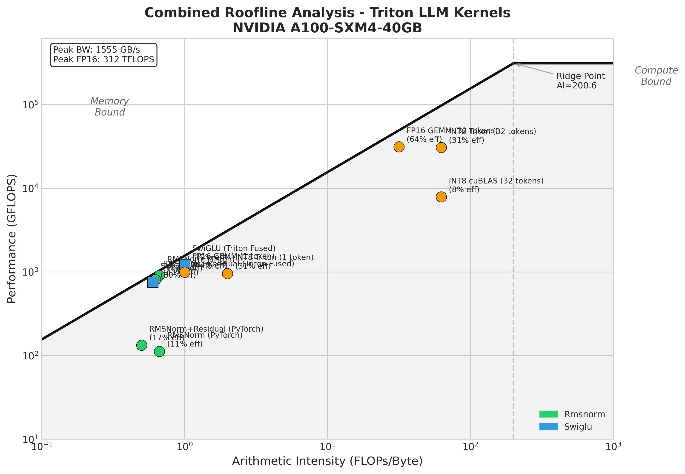

# Triton Kernels

[](https://github.com/Azimml/triton-kernels/actions/workflows/lint.yml)
[](LICENSE)


High-performance GPU kernels for LLM inference, written in [OpenAI Triton](https://triton-lang.org/).

Each kernel is a small, well-documented implementation of a common transformer
operation, paired with a PyTorch reference, a correctness test suite, and a
roofline analysis that explains *why* the optimization works at the hardware
level. The code is cross-platform (NVIDIA and AMD via the Triton backends), with
no vendor-specific CUDA/HIP.

## Why custom kernels?

LLM inference is **memory-bandwidth bound**. A 7B model in FP16 loads ~14 GB of
weights per forward pass; on an A100 (~2 TB/s) that transfer alone is ~7 ms,
while the arithmetic is well under 1 ms. The wins therefore come from moving
*less* data and moving it *more efficiently*:

- **Fuse operations** to eliminate intermediate tensors and extra memory round-trips.
- **Quantize weights** (INT8 / INT4) to shrink the bytes that cross the bus.
- **Schedule memory-aware access patterns** to hit a high fraction of peak bandwidth.

## Kernels

| Kernel | What it does | Optimization rationale | Result |
|--------|--------------|------------------------|--------|
| [`rmsnorm`](triton_kernels/rmsnorm.py) | RMSNorm over the last dim, FP32 accumulation | Memory-bound (AI ~0.7); fuse the whole row into one kernel and pick `num_warps` from the hidden dim so wide rows parallelize the reduction | **8.1x** vs PyTorch, ~88% of peak BW |
| [`rmsnorm_residual_fused`](triton_kernels/rmsnorm.py) | `RMSNorm(x + residual) * w` | Fusing the add saves materializing `x + residual` (4N -> 3N transfers) | **6.0x** vs PyTorch |
| [`swiglu_fused`](triton_kernels/swiglu.py) | `silu(gate) * up` | Fuse SiLU + multiply into one pass; adaptive block size keeps small tensors from starving the SMs | **1.6x** vs PyTorch |
| [`int8_gemm`](triton_kernels/quantized_matmul.py) | W8A16 GEMM (INT8 weights, FP16 activations) | Weight loading is the bottleneck; INT8 halves weight traffic, dequant happens in registers | ~1.0x latency, **2x** less weight memory |
| [`fused_moe_forward`](triton_kernels/moe/fused_moe.py) | MoE dispatch: router -> permute -> grouped expert GEMM -> unpermute | Replace `num_experts x 3` small cuBLAS calls with a block-scheduled grouped GEMM | **up to 9.1x** vs PyTorch loop; beats Megablocks at small batch |
| [`w4a16_gemm`](triton_kernels/w4a16.py) | W4A16 4-bit weight-only GEMM (GPTQ/AWQ) | 4-bit weights, per-group dequant fused into the K-loop, autotuned split-K decode path | **1.2-1.3x vs FP16** (decode), **4x** less weight memory |

Every kernel is paired with a PyTorch reference and validated against it. The
reference math also runs on CPU, so the numerics are testable without a GPU:

| Kernel | PyTorch reference | Design note | Correctness test (GPU) | Reference test (CPU) |
|--------|-------------------|-------------|------------------------|----------------------|
| `rmsnorm` | `rmsnorm_torch` | [rmsnorm.md](docs/rmsnorm.md) | `tests/test_rmsnorm.py` | `tests/test_reference_numerics.py` |
| `swiglu_fused` | `swiglu_torch` | [swiglu.md](docs/swiglu.md) | `tests/test_swiglu.py` | `tests/test_reference_numerics.py` |
| `int8_gemm` | `quantization.py` | [quantization.md](docs/quantization.md) | `tests/test_quantized_matmul.py` | `tests/test_quantization.py` |
| `w4a16_gemm` | [`reference/w4a16_reference.py`](reference/w4a16_reference.py) | [w4a16.md](docs/w4a16.md) | `tests/test_w4a16.py` | `tests/test_w4a16_reference.py` |
| `fused_moe_forward` | [`reference/moe_reference.py`](reference/moe_reference.py) | [moe_dispatch.md](docs/moe_dispatch.md) | `tests/test_moe_dispatch.py` | `tests/test_moe_reference.py` |

### Quantization utilities

`triton_kernels/quantization.py` provides both **symmetric** and **asymmetric
(zero-point / affine)** INT8 weight quantization. Symmetric is the default and
near-optimal for zero-centred weights; asymmetric spends all 256 INT8 codes on
the observed `[min, max]` range and wins by ~6 dB SNR on skewed distributions.

```python
from triton_kernels import quantize_weight_per_channel_asymmetric, dequantize

w_int8, scale, zero_point = quantize_weight_per_channel_asymmetric(weight)  # (out, in)
w_restored = dequantize(w_int8, scale, dim=0, zero_point=zero_point)
```

See [docs/quantization.md](docs/quantization.md) for the schemes, the accuracy
comparison, and the full API.

## Roofline methodology

Every kernel is placed on a [roofline](https://en.wikipedia.org/wiki/Roofline_model)
so its performance is judged against a hardware ceiling, not just against
PyTorch. For each kernel we count the FLOPs and the bytes moved, compute the
**arithmetic intensity** (FLOPs/byte), and measure achieved throughput with
warmup via `triton.testing.do_bench`. That point is plotted against two
ceilings:

- **Memory roof**: `achievable = peak_bandwidth x AI` (the diagonal).
- **Compute roof**: `achievable = peak_TFLOPS` (the plateau).

A kernel below the diagonal is memory-bound (optimize traffic: fuse, quantize);
one on the plateau is compute-bound (optimize arithmetic). Peak memory bandwidth
is derived dynamically from the CUDA device properties (memory clock x bus width)
with an `nvidia-smi` / static-table fallback (`benchmarks/utils.py`). Most LLM
inference ops land in the memory-bound region, which is why the optimizations
here target memory traffic.



See [docs/ROOFLINE_ANALYSIS.md](docs/ROOFLINE_ANALYSIS.md) for the full analysis.

## The INT8 postmortem (why W8A16 is a memory win, not a compute win)

[docs/INT8_GEMM_INVESTIGATION.md](docs/INT8_GEMM_INVESTIGATION.md) is a debugging
writeup of why the first INT8 kernel was **3x slower** than FP16, and what fixed
it. The short version:

- A `tl.dot` on FP32-cast inputs silently skips the tensor cores. A100 tensor
  cores only do FP16xFP16, BF16xBF16, and INT8xINT8 - never FP32.
- INT8 tensor cores *are* ~2x faster at the matmul, but the activation
  quant/dequant overhead cancels the gain for W8A16, so the real payoff is the
  **2x weight-memory reduction**, not raw compute.
- `torch._int_mm` is 5x slower if you hand it the wrong (row-major) `B`; the
  column-major transpose **view** (not `.contiguous()`) triggers the fast path.

It is included deliberately - measuring the full pipeline, finding the bug, and
reporting the result honestly is the point.

## Installation

```bash
git clone https://github.com/Azimml/triton-kernels.git
cd triton-kernels

pip install -e .            # runtime only
pip install -e ".[all]"     # + testing, benchmarking, lint (ruff, mypy)
```

**Requirements**

- Python 3.10+
- PyTorch 2.1+
- Triton 3.0+
- NVIDIA GPU (compute capability 8.0+) or AMD GPU (MI250X/MI300X via ROCm)

## Quick start

```python
import torch
from triton_kernels import rmsnorm_residual_fused, swiglu_fused, int8_gemm, quantize_weight_per_channel

# Fused RMSNorm + residual: normalize(x + residual)
x = torch.randn(1, 2048, 4096, device="cuda", dtype=torch.float16)
residual = torch.randn_like(x)
weight = torch.ones(4096, device="cuda", dtype=torch.float16)
y = rmsnorm_residual_fused(x, residual, weight, eps=1e-6)

# Fused SwiGLU: silu(gate) * up
gate = torch.randn(1, 2048, 11008, device="cuda", dtype=torch.float16)
up = torch.randn_like(gate)
y = swiglu_fused(gate, up)

# W8A16 GEMM: INT8 weights, FP16 activations
weight_fp16 = torch.randn(11008, 4096, dtype=torch.float16)
weight_int8, scale = quantize_weight_per_channel(weight_fp16)
y = int8_gemm(x.view(-1, 4096), weight_int8.cuda(), scale.cuda())
```

### Drop-in modules

```python
from triton_kernels import TritonRMSNorm, SwiGLU, Int8Linear, QuantizedLinear

norm = TritonRMSNorm(hidden_size=4096, eps=1e-6).cuda()   # replaces nn.RMSNorm
act = SwiGLU()                                            # replaces F.silu(gate) * up
linear = Int8Linear.from_linear(pretrained_linear)        # INT8 weights + optimized GEMM
qlin = QuantizedLinear.from_linear(pretrained_linear, scheme="asymmetric")  # affine INT8 ref
```

## Examples

CPU-only scripts under [`examples/`](examples/) call the PyTorch reference
implementations (no GPU or Triton required), so they run anywhere and show the
numerics the kernels are validated against:

```bash
python examples/quantization_roundtrip.py   # INT8 sym vs asym error metrics
python examples/w4a16_reference_demo.py      # 4-bit weight-only GEMM, 4x smaller weights
python examples/moe_reference_demo.py        # top-2/8-expert MoE + per-expert token load
```

See [examples/README.md](examples/README.md) for details.

## Running the tests

The GPU kernel tests skip automatically when no CUDA device is present, so the
suite is safe to run anywhere; the quantization numerics, reference math, and
host-side launch heuristics run on CPU.

```bash
pytest tests/                       # full suite (GPU tests skip without CUDA)
pytest tests/test_quantization.py   # CPU: symmetric + asymmetric numerics
pytest tests/test_host_heuristics.py  # CPU: launch-config heuristics
```

CPU-side quality gate (matches the `lint` CI workflow):

```bash
ruff check .
ruff format --check .
mypy            # advisory
```

## Running the benchmarks

```bash
python -m benchmarks.bench_rmsnorm
python -m benchmarks.bench_swiglu
python -m benchmarks.bench_quantized_matmul
python -m benchmarks.bench_w4a16

# MoE dispatch (vs PyTorch loop and Megablocks)
python -m benchmarks.bench_moe_dispatch --model mixtral-8x7b --batch-sizes 32,128,512,2048

# Roofline plots + analysis doc
python -m benchmarks.full_roofline --output-dir docs/figures
python -m benchmarks.roofline.moe_roofline --model mixtral-8x7b --num-tokens 512
```

### Benchmark results (A100-SXM4-40GB)

LLaMA 7B-style dims (hidden=4096, ffn=11008, seq_len=2048).

| Kernel | Latency (ms) | Bandwidth (GB/s) | % of Peak | Speedup |
|--------|-------------:|-----------------:|----------:|--------:|
| RMSNorm (PyTorch) | 0.30 | 168 | 11% | 1.0x |
| RMSNorm (Triton) | 0.04 | 1365 | 88% | **8.1x** |
| RMSNorm+Residual (PyTorch) | 0.32 | 266 | 17% | 1.0x |
| RMSNorm+Residual (Triton fused) | 0.05 | 1285 | 83% | **6.0x** |
| SwiGLU (PyTorch) | 0.18 | 1251 | 80% | 1.0x |
| SwiGLU (Triton fused) | 0.11 | 1223 | 79% | **1.6x** |
| FP16 GEMM (cuBLAS) | 0.76 | 200 | - | 1.0x |
| INT8 GEMM (Triton) | 0.09 | 480 | 31% | ~1.0x |

*Peak bandwidth 1555 GB/s. INT8 GEMM's value is 2x weight-memory reduction.*

MoE dispatch (Mixtral-8x7B, A100-SXM4-80GB) beats the PyTorch loop by 4-6.5x and
matches or beats CUDA-optimized Megablocks at inference-relevant batch sizes; see
[docs/moe_dispatch.md](docs/moe_dispatch.md).

## Hardware notes (portability)

- **NVIDIA**: primary target, tested on A100 (SM80). Compute capability 8.0+
  recommended for INT8/BF16 tensor cores.
- **AMD**: the pure-Triton kernels run on ROCm via the Triton backend; MoE
  dispatch and W4A16 are correctness-validated on MI300X. Performance is tuned
  for NVIDIA; AMD is validated for correctness.
- The kernels select launch parameters (block size, `num_warps`) from tensor
  shapes on the host, so they adapt across architectures without a device probe.

## Project layout

```
triton_kernels/     RMSNorm, SwiGLU, INT8/W4A16 quant + GEMMs, moe/ dispatch
reference/          PyTorch ground-truth implementations (CPU)
tests/              Correctness + CPU numerics/heuristics tests
benchmarks/         Benchmark suite + roofline/ analysis
docs/               Roofline analysis, quantization, MoE writeup, INT8 postmortem, figures
```

## Limitations

- **Educational, not production.** For production inference use
  [FlashAttention](https://github.com/Dao-AILab/flash-attention),
  [vLLM](https://github.com/vllm-project/vllm), or
  [TensorRT-LLM](https://github.com/NVIDIA/TensorRT-LLM).
- **No attention kernel.** A fused attention is a stretch goal; FlashAttention is
  considerably more involved.
- The asymmetric INT8 **reference and storage format** are complete and
  CPU-tested; feeding the zero-point through the INT8 GEMM kernel itself is the
  next GPU-side step (see [docs/quantization.md](docs/quantization.md)).

## References

- [Making Deep Learning Go Brrrr (Horace He)](https://horace.io/brrr_intro.html)
- [Triton documentation](https://triton-lang.org/)
- [RMSNorm (Zhang & Sennrich)](https://arxiv.org/abs/1910.07467)
- [PaLM / SwiGLU (Chowdhery et al.)](https://arxiv.org/abs/2204.02311)
- [LLM.int8() (Dettmers et al.)](https://arxiv.org/abs/2208.07339)
- [Quantizing DNNs for efficient inference (Krishnamoorthi)](https://arxiv.org/abs/1806.08342) - affine/asymmetric scheme
- [MegaBlocks (Gale et al.)](https://arxiv.org/abs/2211.15841)
- [Mixtral of Experts (Jiang et al.)](https://arxiv.org/abs/2401.04088)
- [DeepSeek-V3 Technical Report](https://arxiv.org/abs/2412.19437)

## License

Released under the [MIT License](LICENSE).
